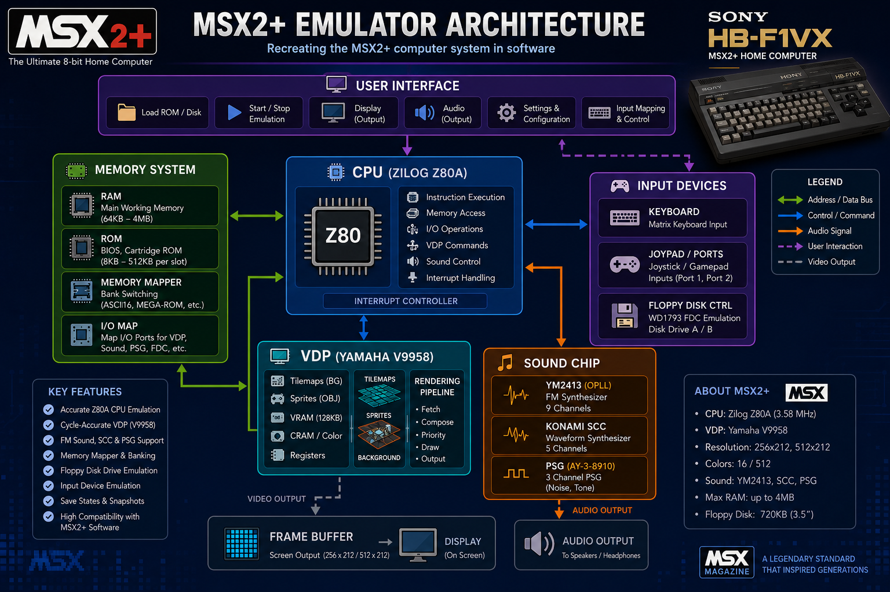

## Project Description

A production-oriented emulator designed to reproduce the behavior of the
Sony HB-F1XV “HitBit,” an MSX2+ home computer released in Japan in 1988.

## Legal and Intellectual Property Notice

This project is an independently developed, unofficial emulator intended
for educational, research, preservation, interoperability, and personal-use
purposes. It is not affiliated with, authorized by, endorsed by, sponsored
by, or otherwise associated with Sony Group Corporation, Microsoft
Corporation, ASCII Corporation, or any other rights holder connected with
the original hardware, software, or MSX platform.

Sony, HitBit, HB-F1XV, MSX, MSX2+, and all other third-party names, product
designations, trademarks, service marks, registered marks, and logos
referenced by this project remain the property of their respective owners,
where applicable. Such references are used solely to identify and describe
the hardware and software environment that this emulator is designed to
reproduce. No affiliation, endorsement, sponsorship, or authorization is
expressed or implied.

This repository and its release packages contain only independently
developed emulator source code and project-created materials, except where
third-party components are separately identified and distributed under
their respective licences.

This project does not include, distribute, sublicense, or grant rights to
any proprietary BIOS, firmware, ROM image, system software, game software,
encryption key, copyrighted documentation, artwork, logo, font, or other
third-party material belonging to Sony or any other rights holder.

The emulator may require users to provide compatible BIOS, firmware, system
software, or other external materials separately. Users are solely
responsible for obtaining, possessing, copying, configuring, and using such
materials lawfully and in accordance with applicable law and any terms
imposed by their respective rights holders.

No licence, ownership interest, waiver, authorization, or other right in
any third-party intellectual property is granted, expressed, or implied by
this project or its documentation.

Rights in the independently developed emulator source code are governed
solely by the project’s LICENSE file and the applicable copyright notices
contained in the source files.

## The machine

The HB-F1XV arrived at the top of Sony's HitBit line just as the MSX2+ standard launched,
and it packed essentially everything the late MSX platform had to offer into one machine:

- **CPU** — Zilog Z80A at 3.58 MHz, driven through Yamaha's S1985 "MSX-ENGINE" system chipset.
- **Video** — the Yamaha **V9958** video display processor with **128 KB of VRAM**: text modes
  (40×24 / 32×24), bitmap modes up to 512×212 and interlaced 256×424, hardware sprites, a
  VRAM command engine (blits, line draw, fills) — and the MSX2+ headline feature, the
  **YJK modes**, capable of **19,268 simultaneous colors** on screen.
- **Sound** — built-in **MSX-MUSIC**: a Yamaha **YM2413 (OPLL)** 9-channel FM synthesizer with
  its BASIC extension ROM, alongside the S1985's PSG. (The Panasonic FM-PAC cartridge — FM plus
  8 KB of battery-backed save SRAM — was a popular external add-on and is emulated as one.)
- **Storage** — a built-in **720 KB 3.5″ floppy drive** on a WD2793-family controller,
  plus the cassette interface.
- **Memory / firmware** — 64 KB of main RAM and an 80 KB ROM set: MSX-BASIC/BIOS (32 KB),
  the MSX2+ SUB-ROM with BASIC 3.0 (16 KB), KANJI BASIC plus the kanji character ROM (16 KB),
  and the disk ROM (16 KB) — full Japanese text support was standard.
- **I/O** — two cartridge slots, two joystick ports, printer port, RGB/composite/RF video out,
  and a full-stroke keyboard with five function keys, a numeric keypad, and cursor keys.

## The emulator

This project recreates that machine in modern C++ with a **cycle-aware, deterministic core**:
identical inputs produce identical state and output on every run, timing-sensitive behavior is
modeled against real-hardware documentation, and behavior-affecting changes are A/B-verified
against openMSX. Around the core:

- an **SDL3 desktop frontend** (real-time window, live audio, an in-window menu bar with
  runtime disk/cartridge management) and a **headless frontend** for scripting and testing;
- one codebase, multiple platforms — **Windows (MSVC, incl. ARM64)**, **macOS (AppleClang)**,
  and **Linux / Raspberry Pi (GCC, incl. aarch64)**, auto-detected at configure time;
- the standalone **`msx-diskutil`** utility for creating, inspecting, and formatting
  machine-exact 720 KB MSX-DOS floppy images;
- a deterministic test suite (274 tests) including the full ZEXALL/ZEXDOC Z80
  instruction exercisers.

**Current release: [v1.6.2](#build-history)** — fixes FM-PAC auto-load silently failing (empty
cartridge slot 2) when launched from outside the project directory, on top of v1.6.1's activity LED
and status bar. See [Build History](#build-history) for the full release log.

## Architecture



A system-level overview of the emulated machine: the Z80A CPU and interrupt controller, the
Yamaha V9958 VDP and frame buffer, the PSG / Konami SCC / YM2413 (OPLL) audio path, the WD2793
floppy controller, input devices, and the memory-mapper / slot fabric. (Illustrative overview;
the sections below and the source are the authoritative spec.)

## What works today

- Real Sony BIOS cold boot to the MSX2+ logo and BASIC, with a detailed launch summary of the
  loaded configuration (RAM, VRAM, slots, FM-PAC/SRAM status, disk, video) and the in-window hotkeys.
- Convenience-first launch defaults (v1.1.2): **512 KB RAM, fast-disk ON, and the FM-PAC
  peripheral auto-loaded into slot 2** so its battery SRAM saves are always available (a game
  cartridge in slot 1 coexists) — with `--stock` to restore the authentic bare HB-F1XV in one flag.
- MSX-DOS / Disk BASIC boot from `.dsk` images, multi-disk hot-swap (F11), and disk-save
  persistence back to the host `.dsk` — **ON by default** as of v1.2.2 (a real MSX writes its
  floppies); `--no-disk-writable` keeps disks read-only, and Alt+S toggles it live.
- Cartridge loading with automatic mapper identification (software-database SHA-1 match, then a
  bank-write heuristic), plus an FM-PAC peripheral cartridge: its OPLL mixed into the audio, the
  `CALL FMPAC` backup-manager screen, and 8 KB battery SRAM saved in the openMSX-compatible
  format (existing saves migrated losslessly).
- All V9958 screen and graphic modes (text, GRAPHIC 1–7, YJK/YAE), sprites, and the command
  engine with per-line raster rendering and hardware-timed command duration (the `CE` busy-wait
  window paces software that polls it, so command-driven cut-scenes run at the correct speed).
- Live audio: PSG (YM2149), Konami SCC, and built-in MSX-MUSIC (YM2413) FM, with a
  **master volume** control (`--volume <0..100>`, default 100; Alt+D / Alt+U step it -/+10% live)
  applied strictly after the machine mix — SDL3-presentation only, byte-identical at full volume.
- WD2793 FDC with index-pulse-relative rotational latency on read and write, and a cycle-accurate
  write byte-stream: the sector data-position is decoupled from CPU write timing (a missed slot
  substitutes `0x00`+Lost-Data and advances, never drops), so in-game disk saves are byte-exact
  under any write cadence and land on the latched track/side; `--fast-disk` for near-instant loads.
- Keyboard / joystick, Ren-Sha Turbo, the hardware PAUSE button, and the Speed Controller.
- An SDL3 window that resizes and scales (`--scale`, `--filter`, `--fullscreen`, Alt+Enter),
  a `--capture`-gated F10 live capture hotkey, and opt-in `--ram` sizing (64/128/256/512 KB).
- An **in-window menu bar** (Dear ImGui) — File / Machine / Video / Audio / Disk / Help —
  exposing the existing runtime controls (pause, speed, ren-sha, fullscreen, scale, filter,
  persistence, volume, mute, fast-disk, disk-writable, swap disk, exit) **plus** runtime media
  operations: Open Cartridge (slot 1/2, implies reset), Open Disk(s) with multi-select (REPLACEs the
  `F11` cycle), Eject (disk / cartridge per slot), Reset (disks + carts persist), New Blank Disk
  (a fresh 720 KB MSX-DOS `.dsk`), and BIOS Folder… (pick a BIOS directory — validated then
  applied by a power-cycle). Dirty-disk safety: an outgoing disk flushes to its host `.dsk`
  first when disk-writable is on. The menu is mouse-operated and appears only in an interactive
  window — never under `--hidden-window` / headless, so it never affects determinism or tests.
- Passes the ZEXALL / ZEXDOC Z80 instruction exercisers.
- A standalone **`msx-diskutil` disk utility** (`utils\msx-diskutil.exe`): create / hex-read / format
  720 KB MSX-DOS FAT12 `.dsk` images byte-exact to the machine's own layout (see
  [Disk utility](#disk-utility-msx-diskutil) below).

## Build and test

One codebase, multiple toolchains — **Windows (MSVC), macOS (AppleClang), and Linux /
Raspberry Pi (GCC)** build from the same `CMakeLists.txt`, selected automatically at configure
time. There is no fork and no per-platform build file. There is also one build tree, `build/`,
on every host.

The one-command bootstrap lives in [`setup/`](setup/) (published, so a fresh clone has it —
the day-to-day dev/test/debug helpers under `tools/` are not published): `setup/build.ps1` on
Windows, `setup/build.sh` on macOS / Linux / Raspberry Pi. See [`setup/README.md`](setup/README.md).

The one difference that matters: Visual Studio is a **multi-config** generator (pick the config
at build/test time with `--config` / `-C`), while Ninja / Unix Makefiles are **single-config**
(pick it at *configure* time with `CMAKE_BUILD_TYPE`, then pass no `--config` / `-C` at all).

### Windows

```powershell
powershell -ExecutionPolicy Bypass -File setup/build.ps1 -RunTests
```

This builds SDL3 once from the vendored SDL3 source into `build/_sdl3_install` (only if it is
missing), configures `build/` with `-DSONY_MSX_ENABLE_SDL3=ON` (the superset: both
executables plus all tests), builds Debug, and runs `ctest`.

Manual equivalent:

```powershell
cmake -S . -B build -DSONY_MSX_ENABLE_SDL3=ON "-DCMAKE_PREFIX_PATH=build/_sdl3_install"
cmake --build build --config Debug
ctest --test-dir build -C Debug --output-on-failure
```

- Executables land in `build/Debug/`: `sony_msx_headless.exe`, `sony_msx_sdl3.exe`.
- Fast subset: `ctest --test-dir build -C Debug -LE m24_slow_full_sweep` excludes the
  ~30-minute ZEXALL / ZEXDOC sweep.

Requirements: CMake, a C++20-capable MSVC toolchain (Visual Studio 2022+ with the "Desktop
development with C++" workload), and PowerShell. No separate SDL3 install is needed — it is
built from the bundled source. (Windows on ARM64 builds the same tree with the ARM64 MSVC
toolchain, auto-detected.)

### macOS

```bash
setup/build.sh --run-tests
```

Manual equivalent — note **no `--config` / `-C Debug`** (single-config generator):

```bash
cmake -S . -B build -G Ninja -DCMAKE_BUILD_TYPE=Debug -DSONY_MSX_ENABLE_SDL3=ON
cmake --build build
ctest --test-dir build --output-on-failure
```

- Executables land in **`build/`, not `build/Debug/`**, with no `.exe` suffix:
  `sony_msx_headless`, `sony_msx_sdl3`, `msx-diskutil`. This is the most common trip hazard.
- Fast subset: `ctest --test-dir build -LE m24_slow_full_sweep`.

Requirements: the Xcode Command Line Tools (`xcode-select --install`) for AppleClang, plus
`brew install ninja cmake sdl3`. macOS links **Homebrew's** SDL3 — `find_package(SDL3 CONFIG
REQUIRED)` locates it with no `CMAKE_PREFIX_PATH` argument. To build SDL3 from the vendored
source instead (a machine with no Homebrew SDL3), `setup/build.sh --vendored-sdl3` mirrors what
the Windows bootstrap does. `brew install powershell` is optional and only needed to run the
`tools/*.ps1` asset gates; the test suite itself is pure C++ and needs no PowerShell.

### Linux / Raspberry Pi

```bash
sudo apt install cmake ninja-build build-essential libsdl3-dev   # Debian / Raspberry Pi OS
setup/build.sh --run-tests
```

Same single-config flow as macOS (executables in `build/`, no `--config` / `-C`). The GCC
toolchain — including **aarch64** on a Raspberry Pi 4/5 — is auto-detected; `setup/build.sh`
uses the system `libsdl3-dev` by default, or `--vendored-sdl3` to build SDL3 from the bundled
source. On a small attached panel (e.g. the 7" 800×480 display) the interactive window fits
itself to the usable screen bounds and the menu bar stays fully visible at any scale.

Manual equivalent:

```bash
cmake -S . -B build -DCMAKE_BUILD_TYPE=Debug -DSONY_MSX_ENABLE_SDL3=ON
cmake --build build
ctest --test-dir build --output-on-failure
```

### Both platforms

- Headless-only fallback (no `SDL3Config.cmake` available): reconfigure the same tree with
  `-DSONY_MSX_ENABLE_SDL3=OFF`. This **changes the test count** — the SDL3-gated tests drop out
  of the suite (the standard SDL3=ON fast subset is **273**; the OFF configuration reports a
  correspondingly smaller number). A lower count in that configuration is expected, not a
  regression.
- Some tests report `SKIP` and still pass when an optional game asset is absent; the count stays
  green.

## Disk utility: msx-diskutil

The build also produces a standalone host-side disk tool, post-build-copied to
`utils\msx-diskutil.exe` (`utils/msx-diskutil`, no suffix, on macOS; source in `src/utils/`,
fully build-isolated from the emulator —
neither links the other). It creates, inspects, and formats 720 KB 3.5" DD MSX-DOS FAT12
`.dsk` images (80 tracks x 2 sides x 9 sectors x 512 bytes) byte-exact to the layout the
HB-F1XV's WD2793 / Sony Disk ROM expects:

```powershell
utils\msx-diskutil.exe --create mydisk.dsk           # new fully-formatted blank 720 KB image
utils\msx-diskutil.exe --read mydisk.dsk --sector 0  # hex dump (whole disk, --sector <N>, or --range <A-B> in hex)
utils\msx-diskutil.exe --format mydisk.dsk           # re-format in place
```

On macOS, the same three commands as `./utils/msx-diskutil --create mydisk.dsk` (etc.). The tool
is deterministic across platforms: `--create` produces a byte-identical image on Windows and
macOS (same SHA256).

Safety and determinism: `--create` refuses to overwrite an existing file and `--format`
refuses a file that is not exactly 737,280 bytes — both return exit code 3 unless `--force`
is given (exit codes: 0 success, 1 usage, 2 I/O, 3 safety refusal). Output contains no
timestamps or volume serial, so identical invocations produce byte-identical images. Created
disks are empty data/files media — mounted and recognized by Disk BASIC / MSX-DOS, but not
bootable (no proprietary DOS system files are written; copy `MSXDOS.SYS`/`COMMAND.COM` from
your own MSX-DOS disk to make one bootable).

## Run

Run from the repository root (asset paths and the default software-database path are
resolved relative to the current directory).

**SDL3 frontend** (real window, throttled real-time loop, live audio/input):

```powershell
build\Debug\sony_msx_sdl3.exe                                       # plain BIOS boot to BASIC
build\Debug\sony_msx_sdl3.exe --slot1 "games\roms\Aleste 2\aleste2.rom"   # cartridge in slot 1 (FM-PAC auto-loads into slot 2)
build\Debug\sony_msx_sdl3.exe --disk disks\msxdos23.dsk             # MSX-DOS boot floppy
build\Debug\sony_msx_sdl3.exe --disk games\disks\ys2\ys2-d1.dsk --disk games\disks\ys2\ys2-d2.dsk --disk-writable   # multi-disk game (F11 swaps; saves persist)
```

The same lines on **macOS** — the binary sits in `build/` with no `.exe`, and paths use `/`:

```bash
./build/sony_msx_sdl3                                          # plain BIOS boot to BASIC
./build/sony_msx_sdl3 --slot1 "games/roms/Aleste 2/aleste2.rom" # cartridge in slot 1
./build/sony_msx_sdl3 --disk disks/msxdos23.dsk                 # MSX-DOS boot floppy
./build/sony_msx_sdl3 --disk games/disks/ys2/ys2-d1.dsk --disk games/disks/ys2/ys2-d2.dsk --disk-writable
```

(The game library is organized one folder per title, and several titles contain spaces — quote
those paths.)

Flags:
`--bios-dir <path>` (default `bios`), `--disk <path>` (repeatable — an ordered list, the
first disk inserted at boot, F11 cycles drive A through the rest at runtime), `--slot1 <path>`,
`--slot1-type <name>|auto`, `--slot2 <path>`, `--slot2-type <name>|auto` (the two cartridge slots;
the old `--cart1`/`--cart2`[`-type`] names remain accepted as silent aliases), `--softwaredb <path>`,
`--max-frames <N>`, `--hidden-window`, `--border` / `--no-border` (the framed openMSX-matching
canvas vs the default bare edge-to-edge Sony-original presentation), `--fast-disk` / `--no-fast-disk`
(FDC turbo for near-instant disk loads — **ON by default as of v1.1.2**; `--no-fast-disk` restores
accurate rotational timing; **Alt+F** toggles it live), `--disk-writable` / `--no-disk-writable`
(persist disk writes back to the host `.dsk` — **ON by default as of v1.2.2**; `--no-disk-writable`
keeps disks read-only; Alt+S toggles it live), `--volume <0..100>` (master volume percent, default
`100` = full; attenuation only; Alt+D / Alt+U step it -/+10% live; SDL3 presentation only),
`--dump-state <name>`, `--trace-cpu <name>`, `--event-log <name>`,
`--input-script <path>`, `--snapshot <dir>`, `--fmpac-sram <path>` / `--no-fmpac-sram`
(override / opt out of the FM-PAC battery-SRAM auto-persistence, which otherwise saves to
`<cart-rom-path>.sram`), `--speed <0..7>` (initial Speed Controller level — a CPU slow-down
duty cycle, not a turbo; 0 = full speed, the default; F6/F7 still step it at runtime),
`--scale <1..8>` (initial MSX picture size `320N x 240N`, default `3` = 960×720; the window
is that plus the menu-bar strip on top so the picture stays fully visible below the menu; the
window is resizable and the picture stays aspect-correct letterboxed at any size),
`--filter <nearest|linear>` (texture scaling filter, default `linear`), `--fullscreen`
(Alt+Enter toggles at runtime), `--capture <on|off>` (default `off`; gates the F10 live
capture hotkey so a mis-struck F10 is inert during play — F11 disk-swap and F12 snapshot are
unaffected), `--stream-light`,
`--ram <64|128|256|512>` (main-RAM size in KB; **default `512` as of v1.1.2** — a "fully-populated
S1985" mod for larger games, `512` KB being the internal ceiling of the S1985 5-bit mapper
read-back; `--ram 64` restores the stock HB-F1XV spec; beyond 512 KB needs an external
RAM-expansion cartridge), `--no-fmpac` (skip the default FM-PAC auto-load), `--stock` (one-shot
authentic bare machine: 64 KB + accurate disk timing + no FM-PAC; explicit per-option flags still
win, e.g. `--stock --ram 512`),
`--help`. A `--slotN-type` (or the `--cartN-type` alias) of `auto` (or omitted) triggers
auto-identification; an explicit type is honored byte-for-byte.

By default (v1.1.2) the machine boots ready-to-play: **512 KB RAM, fast-disk ON, and the FM-PAC
peripheral auto-loaded into slot 2** (from `roms/fmpac.rom`, SRAM persisted to
`roms/fmpac.rom.sram`) so its battery saves are always available; a game cartridge in slot 1
coexists with it. `--no-fmpac` skips the auto-load, an explicit `--slot2 <rom>` overrides it, a
missing `roms/fmpac.rom` is skipped gracefully, and `--stock` reverts all three defaults to the
authentic bare HB-F1XV.

### In-window menu bar

An interactive SDL3 launch shows a **Dear ImGui menu bar** across the top of the window
(**mouse-operated**; the menu is chrome only and never appears under `--hidden-window` or in the
headless build). Its layout:

- **File** — Open Cartridge ▸ Slot 1 / Slot 2… (runtime `.rom` insert; **implies a machine
  reset**), Open Disk(s)… (multi-select — the selection **REPLACES** the `F11` cycle, mounts the
  first, and `F11` then cycles the new set), Swap Disk (`F11`, enabled with more than one disk),
  Eject ▸ Disk (enabled when a disk is mounted) / Cartridge Slot 1 / Slot 2 (each enabled when that
  slot is occupied; **cartridge eject implies a reset**), Exit.
- **Machine** — Pause (`PAUSE`), Reset (mounted disks and inserted cartridges **persist** across the
  reset), Speed 0–7 (`F6`/`F7`), Ren-Sha Turbo 0–100% (`F8`/`F9`), RAM 64–512 KB (live — selecting a
  different size **power-cycles** the machine at that size, media surviving), BIOS Folder… (pick a
  different BIOS directory at runtime — the selection is validated first: all 7 BIOS ROM files must
  be present and readable, otherwise the current folder is kept untouched; a valid folder
  **power-cycles** the machine into the new BIOS, same RAM, media surviving; the menu label shows
  the current folder name).
- **Video** — Fullscreen (`Alt+Enter`), Scale 1×–8×, Filter Linear/Nearest, Border *(startup only
  — grayed)*, Persistence ±10% (`Alt+B` / `Shift+Alt+B`), Persistence Mode avg/peak (`Alt+M`).
- **Audio** — Volume ±10% (`Alt+D` / `Alt+U`), Mute.
- **Disk** — Fast Disk (`Alt+F`), Disk Writable (`Alt+S`), New Blank Disk… (writes a fresh,
  DOS-recognizable, deliberately non-bootable 720 KB MSX-DOS disk; open it with File ▸ Open Disk to
  use).
- **Help** — Hotkeys (the full in-window hotkey list, drawn from the same single source the menu
  items use), About.

Checkmarks reflect live state and the hotkey labels are the exact in-window hotkeys. Enabled-state
logic is per-item (Eject Disk only when a disk is mounted, Eject Cartridge only when that slot is
occupied, etc.); only Border (no runtime setter) stays grayed. Disk
insert/eject/replace flush the outgoing disk to its host `.dsk` first **when disk-writable is on**,
so no in-session save is lost; with disk-writable off, in-memory writes are discarded (stderr-noted).
Keyboard navigation is deliberately off, so the `Alt+`letter host hotkeys keep working while the
menu is visible. The menu bar is a **Windows/macOS interactive-only** feature.

**Headless** (`sony_msx_headless.exe`) is mode-driven; the main mode is:

```powershell
build\Debug\sony_msx_headless.exe --debug-session bios 0 --disk disks\msxdos23.dsk `
    --frames 1000 --dump-frame boot.frame --dump-state state.txt --event-log run.log
```

`--debug-session <bios_dir> <max_steps>` accepts `--disk`, `--slot1/--slot1-type`,
`--slot2/--slot2-type` (aliases `--cart1/--cart2[-type]`), `--softwaredb`, `--debug-root`,
`--dump-state`, `--trace-cpu`, `--event-log`, `--input-script`, `--frames <N>`,
`--dump-frame <name>`, `--disk-writable`, `--fast-disk` / `--no-fast-disk`, `--no-fmpac`,
`--stock`, `--swap-disk-frame <N>`, `--fmpac-sram <path>`, `--snapshot <dir>` / `--snapshot-frame <N>`,
and `--stream-light`. It shares the SDL3 frontend's v1.1.2 convenience defaults (512 KB, fast-disk,
FM-PAC into slot 2; `--stock` reverts them). Other single-purpose modes (e.g. the openMSX-parity
identification path) keep their own stock defaults and each print their own usage.

## Configuration file (optional)

Every default and knob can be externalized to a strict XML config file, so the machine is
configurable without recompiling: RAM/VRAM, fast-disk, FM-PAC auto-load, video scale/filter,
persistence, border, disk-writable, master volume, speed, fullscreen, capture, BIOS directory + the
seven ROM filenames, FM-PAC ROM/SRAM paths, the cartridge/disk dialog directories, and the
software-database path — each written with its type and allowed range/enum as a comment.

**You do not have to create this file.** As of v1.6.0 an interactive session **writes it for you**,
as `sony_msx_hbf1xv.xml` beside the executable, so your settings persist across runs. Launch the
emulator once, adjust things from the menu, quit — the file appears, fully annotated, and you can
hand-edit it from there.

- **Optional.** The emulator always runs standalone with zero config; if no config file is found it
  prints one warning line and continues on the built-in defaults.
- **Precedence:** command-line flag **>** config file **>** built-in default. An explicit CLI flag
  always wins; the config file overrides the compiled default; an omitted knob keeps its default.
- **Auto-load** happens only on an interactive SDL3 launch (a real window), searching
  `<exe-dir>/sony_msx_hbf1xv.xml` then `<cwd>/sony_msx_hbf1xv.xml`. The headless executable and the
  deterministic hidden-window/test paths never auto-load. `--config <path>` force-loads in any mode.
- **Auto-save** is deliberately narrow: it happens **only** for a genuinely interactive launch with
  no explicit `--config`. Under `--hidden-window`, headless, or an explicit `--config`, settings
  writes are disabled outright — that gate is what keeps the deterministic suite byte-identical.
- **Your hand edits survive.** A rewrite re-emits the full config from the loaded file as its
  baseline, overwriting only the presentation and sticky knobs from live state — so a hand-authored
  `<machine>` section is preserved rather than flattened back to defaults.
- **Strict but never fatal:** each value is type- and range/enum-checked; a bad value warns naming
  the offending key and falls back to that key's default (the rest of the file still applies), never
  crashing.
- **Hardware timing is not configurable.** The Z80A clock, interrupt-acknowledge timings, V9958
  access-slot/line cycles, WD2793 FDC timing, and the strict 128 KB VRAM are the silicon spec and
  stay fixed in code, so no config edit can degrade emulation accuracy.

## Build History

Newest first. Each release was gated by the full deterministic test suite and, for
behavior-affecting changes, screen/trace A/B comparison against openMSX.

### v1.6.2 — FM-PAC auto-load path fix
- **Fixed: cartridge slot 2 coming up empty.** FM-PAC failed to auto-load — silently, with no
  error — whenever the emulator was launched from a directory other than the one its asset paths
  were relative to. The status bar just showed `S2 -` and FM-PAC battery saves were unavailable.
- Cause: v1.6.0 writes the settings file beside the executable, but relative asset paths resolve
  against the *working directory*, so a persisted `roms/fmpac.rom` stopped resolving as soon as you
  launched from elsewhere. (The BIOS directory was unaffected only because the BIOS-folder picker
  already stored an absolute path — which is why the machine still booted normally.)
- Settings are now persisted with **absolute** asset paths, and an existing config upgrades itself
  on the next run. Hand-authored absolute paths are preserved verbatim, and the BIOS ROM *filenames*
  stay relative to the BIOS directory so `Machine ▸ BIOS Folder…` keeps working.
- On a new machine, launch once from the repo root with your assets in place — the paths that get
  locked in are the ones that resolved at that moment.

### v1.6.1 — floppy activity LED + system status bar
- **A bottom status bar** showing live machine state, and an **FDD activity LED** driven by the
  *real* drive motor line (with the hardware's ~4 s delayed motor-off, so even a brief fast-disk
  access stays lit — exactly like a real front-panel floppy LED).
- The picture reserves the strip and the window grows to match — mirroring the top menu bar — so
  the MSX display keeps its size wherever the screen has room.
- Frontend/ImGui only: no device changes, and the deterministic suite is byte-identical.

### v1.6.0 — persistent settings + File ▸ Recent
- **Your settings now persist across sessions.** An interactive session writes
  `sony_msx_hbf1xv.xml` beside the executable, so scale, filter, volume, persistence, fast-disk and
  the rest come back the way you left them. Hand-authored `<machine>` sections survive the rewrite —
  it re-emits from the loaded file as a baseline rather than flattening to defaults. Writes are
  disabled entirely under `--hidden-window` / headless / explicit `--config`, which is what keeps
  the deterministic suite byte-identical.
- **File ▸ Recent** lists previously opened disks and cartridges for one-click reloading.
- **Media-open safety guards** — extension and 720 KB write-back checks, closing a disk-write-back
  data-loss footgun.
- Also in this release: the host disk utility was renamed `msx-disk` → **`msx-diskutil`**
  (source now under `src/utils/`).

### v1.5.0 — Raspberry Pi / Linux support, small-display polish, F-1 Spirit fix
- **Raspberry Pi & Linux are now first-class build targets** (GCC, including aarch64) alongside
  Windows (MSVC, incl. ARM64) and macOS (AppleClang) — one codebase, one `CMakeLists.txt`, one
  `build/` tree, toolchain auto-detected, and the source audits clean for case-sensitivity and
  ARM signedness. A published one-command bootstrap now lives in [`setup/`](setup/) —
  `setup/build.ps1` (Windows) and `setup/build.sh` (macOS / Linux / Raspberry Pi) — so a fresh
  clone builds out of the box.
- **F-1 Spirit 3D Special flicker fixed** — the command-row sink no longer seals rows *ahead*
  of the render beam with frame-start scroll registers and a not-yet-written sprite table, so
  the racing view is stable (a permanent regression oracle guards it, and *Aleste 2* /
  *Firebird* / *Laydock 2* stay flicker-free). Classified as an emulator defect — not authentic
  sprite multiplex — by a decisive openMSX A/B.
- **Raspberry Pi / small-display polish** — the interactive window now fits itself to the usable
  screen bounds at launch (so it never opens larger than, e.g., a 7" 800×480 panel) and re-clamps
  on resize/maximize; the in-window menu bar renders correctly in windowed **and** fullscreen on
  the Pi's SDL3 render driver.
- **File-dialog default directories** — Machine ▸ BIOS Folder… opens at the current `bios/`
  directory; File ▸ Open Cartridge opens at the working directory.
- **Machine ▸ BIOS Folder…** — a runtime BIOS-directory selector: pick a folder, and the
  machine power-cycles into it (same RAM, mounted media survive). Transactional — the folder
  is validated to hold all seven BIOS ROMs before switching, else the selection is declined
  with the running machine untouched.

### v1.4.1 — FDC disk-change protocol fix
- The Sony FDC's disk-change (DSKCHG) one-shot is now reported and consumed **only when the
  drive is actually selected** (Shugart drive-select gating, per the hardware fact sheet).
- Previously, an unselected-drive probe consumed the notification, so after a mid-game disk
  swap MSX-DOS could keep the previous disk's FAT and read every file on the new disk through
  stale filesystem state — whole-screen garbage in multi-disk titles that load after a swap.
- Root-caused and verified with *Sangokushi 2 (Romance of the Three Kingdoms 2)*, which now
  renders correctly; a permanent regression oracle guards it. Swap-then-save flows
  (e.g. YS II's save disk) are now protocol-correct.
- Also in this release: third-party build inputs vendored under `src/external/`
  (ImGui / SDL3 / ZEXALL, licenses in-tree), so a fresh clone builds out of the box.

### v1.4.0 — live RAM switching + menu fixes
- **Machine ▸ RAM 64/128/256/512 KB** now power-cycles the machine into the new size — a true
  off/on with mounted disks and cartridges surviving, verified byte-identical to a fresh boot
  at every size.
- Fixed **audio silence after any menu-driven reset**: the audio pacer's cumulative accounting
  survived the reset and muted everything from the first File ▸ Open onward; it now rewinds on
  every machine-lifecycle event (regression-tested at boot *and* post-reset).
- Fixed the **menu strip covering the picture**: the display letterboxes into the band below
  the bar, the window grows by the strip height so `--scale N` stays unclipped, and fullscreen
  insets correctly.

### v1.3.0 — the in-window menu bar
- A full **Dear ImGui menu bar** (File / Machine / Video / Audio / Disk / Help), identical on
  Windows and macOS, with **runtime media management**: open floppies with multi-select (the
  selection becomes the F11 rotation), insert cartridges mid-session (auto mapper detection +
  the authentic implied reset), eject, a true power-on Reset, and New Blank Disk.
- Disk safety is transactional: writable dirty disks flush to the host `.dsk` before any
  replace/eject; a bad selection aborts with the current disk untouched.
- All menu machinery is interactive-only — headless runs and the deterministic suite are
  byte-identical with or without it.

### Between v1.2.2 and v1.3.0 (untagged)
- The standalone **`msx-diskutil`** utility (create / hex-read / format, byte-exact 720 KB images).
- **macOS support**: one codebase, two toolchains (MSVC + AppleClang), auto-detected at
  configure time — no fork, no per-platform build files.

### v1.2.2 — sound and disk quality-of-life
- **Master volume** (`--volume <0..100>`, an XML config knob, live Alt+D / Alt+U steps) applied
  strictly after the machine mix — byte-identical at full volume.
- **Disk-save write-back ON by default** (a real MSX writes its floppies); `--no-disk-writable`
  or the Alt+S live toggle keep disks read-only. Fast-disk hotkey moved to **Alt+F**.

### v1.2.1 — V9958 sprite-visibility fix
- Rows redrawn by the VDP command engine (blits) are now sprite-paced before being sealed into
  the frame, so sprites no longer vanish or flicker in games that rebuild scrolling terrain
  with command blits (*Aleste 2*, *Firebird*, *Laydock 2*) — a v1.1.6 regression, root-caused
  by bisect and verified frame-for-frame against openMSX at a zero-flicker match.

### v1.2.0 — external configuration
- Optional **strict-XML configuration** (`sony_msx_hbf1xv.xml`): every
  launch knob in one annotated file, resolved **CLI > XML > built-in default**. Hardware-timing
  constants are deliberately *not* configurable.

### The v1.1.x line
- **v1.1.8** — MSX-logo Windows app icon.
- **v1.1.7** — optional phosphor-persistence flicker softener (`--persistence`, Alt+B / Alt+M).
- **v1.1.6** — per-line-live V9958 sprite rendering (split-screen HUD titles like
  *Space Manbow* / *Laydock 2*).
- **v1.1.5** — the V9958 command-engine access-slot contention model.
- **v1.1.4** — Z80A / V9958 / PSG timing parity with the real Sony hardware
  (interrupt-acknowledge timings, command-engine durations, PSG counter phase).
- **v1.1.2** — convenience-first launch defaults (512 KB RAM, fast-disk ON, FM-PAC
  auto-loaded into slot 2), with `--stock` restoring the authentic bare 1988 machine.
- **v1.1.0–v1.1.1** — FM-PAC screen/SRAM fidelity and the WD2793 write-path fixes that made
  in-game disk saves byte-exact.

## Repository layout

- `src/` — emulator source (`core`, `devices`, `peripherals`, `machine`, `frontend`), plus the
  standalone `msx-diskutil` tool source in `src/utils/` and vendored build inputs in
  `src/external/` (ImGui / SDL3 / ZEXALL).
- `setup/` — the published one-command build bootstrap (`build.ps1`, `build.sh`) — see
  [`setup/README.md`](setup/README.md).
- `bios/`, `roms/`, `disks/`, `games/` — local, legally-sourced development assets (see below).
- `build/` — the CMake build tree (gitignored; recreate any time with `setup/build.ps1` on
  Windows or `setup/build.sh` on macOS / Linux / Raspberry Pi).

## Assets (BIOS / ROM / disk policy)

This project does **not** contain or distribute any proprietary BIOS, firmware, ROM image, or
disk asset. **You supply your own**, placed into these local directories (all of which ship on
the remote as an empty skeleton — README + `.gitkeep` only):

- `bios/` — the seven Sony HB-F1XV system ROMs (see [`bios/README.md`](bios/README.md) for the
  required filenames and the IP notice).
- `roms/` — the Panasonic FM-PAC firmware `fmpac.rom` and its battery-SRAM `fmpac.rom.sram`
  (see [`roms/README.md`](roms/README.md)).
- `disks/` — MSX-DOS system disks; `games/` — your game library
  (`games/disks/<title>/` floppy sets and `games/roms/<title>/` cartridge images).

These remain third-party intellectual property; this project asserts no redistribution rights,
makes no provenance claim, and grants no licence to them. You are solely responsible for
obtaining and using such materials lawfully. (Per **DEC-0093** none of these proprietary
binaries are tracked or published — reversing the earlier DEC-0047 decision to host `bios/` +
the FM-PAC firmware; older binaries nonetheless remain in pre-DEC-0093 git history.) Once you
have placed your assets, validate the required set with:

```powershell
./tools/validate-assets.ps1
```

On macOS (PowerShell 7 via `brew install powershell`; drop the Windows-only
`-ExecutionPolicy Bypass`):

```bash
pwsh -File tools/validate-assets.ps1
```

## License

The emulator source is provided for personal, non-commercial reference and educational study
(see the notice at the top of each source file). Proprietary BIOS / ROM / disk assets are the
property of their respective rights holders and are **not** licensed by this project.
